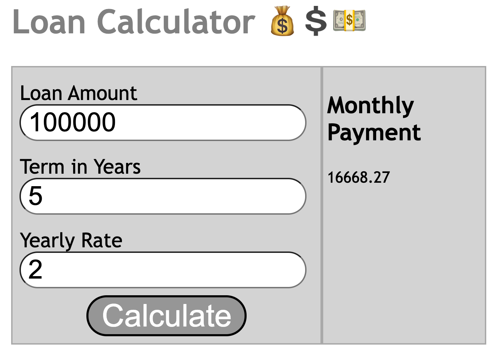

# Testing with Jasmine
Jasmine is a JS testing framework, which is easy to read and aids in documentation.

To run tests in the browser with Jasmine, make sure to include the following in your HTML. Then, simply open your HTML in your browser.

```
<head>
<title>Taxes Tests</title>

<!-- include CSS for Jasmine -->
<link rel="stylesheet"
  href="https://unpkg.com/jasmine-core/lib/jasmine-core/jasmine.css" />
</head>
<body>

<!-- include JS for Jasmine -->  
<script 
  src="https://unpkg.com/jasmine-core/lib/jasmine-core/jasmine.js"></script>
<script 
  src="https://unpkg.com/jasmine-core/lib/jasmine-core/jasmine-html.js"></script>
<script 
  src= "https://unpkg.com/jasmine-core/lib/jasmine-core/boot.js"></script>

<!-- include your JS & test file -->
<script src="taxes.js"></script> 
<script src="taxes.test.js"></script>
</body>
```

To write tests with Jasmine, create your code to be tested in a file such as ```calculator.js``` and your code which tests in a file such as ```calculator.test.js```

# Jasmine Matchers
## .toEqual(obj)
When different objects have the same values inside them

## .toBe(obj)
Testing to see if both cases are the same exact object

## .toContain(obj)
Does this object contain a certain item?

## .not
Add before another matcher to invert it

https://jasmine.github.io/api/edge/matchers.html

# What Do We Test?
* Every function
* Edge cases
  * What if the object were empty?
  * What about other types?
  * what if the file isn't found?
  * Are different cases handled differently?

# Additional Notes
Make code easier to test by seperating logic and UI updates into seperate functions
Making more, smaller functions makes the code easier to read, test & debug




