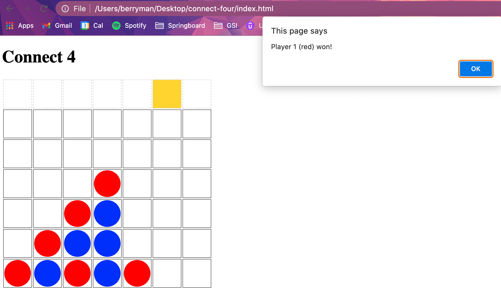

# Connect 4
### Player 1 and 2 alternate turns. On each turn, a piece is dropped down a column until a player gets four-in-a-row (horiz, vert, or diag) or until board fills (tie)

Set board to empty HEIGHT x WIDTH matrix array with `makeBoard()`

Make HTML table and row of column tops with `makeHtmlBoard()`

Given column x, return top empty y (null if filled) with `findSpotForCol(x)`

Update DOM to place piece into board HTML table with `placeInTable(y,  x,  color)`

Announce game end with `endGame(msg)`

Handle click of column top to play piece with `handleClick(evt)`

Check board cell-by-cell for "does a win start here?" with `checkForWin()`

