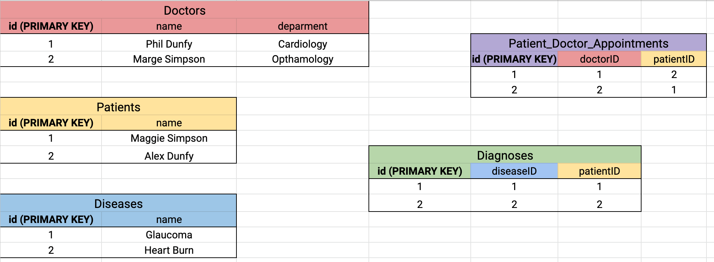
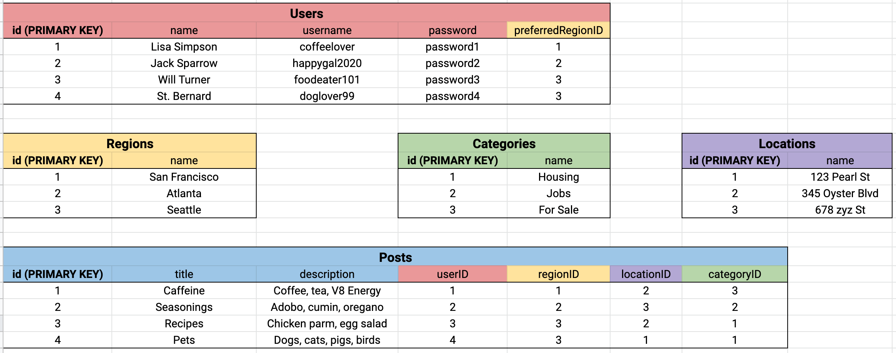
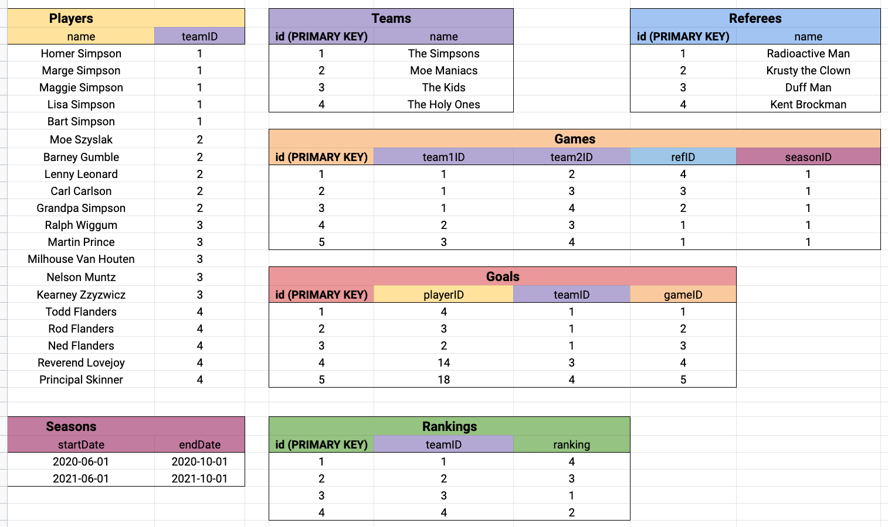

# Data Modeling Exercise
## Kaitlin Berryman - Springboard Software Engineering Bootcamp
For each exercise, diagram each table and relationship. Also record any other helpful information, including potential challenges with the model and/or the information.

Then, write out the DDL operations you'd need to create the tables. Insert some data into your database to make sure it works as expected.

## Part 1 - Schema Design
### 1 - Medial Center
Design the schema for a medical center
- The medical center employs several doctors
- A doctor can see many patients
- A patient can be seen by many doctors
- During a visit, a patient may be diagnosed to have one or more diseases

Diagram - 

DDL Operations - [Medical Center DDL SQL File](./medical_center.sql)

Other Helpful Info -

Potential Challenges -

### 2 - Craigslist
Design the schema for Craigslist. Keep track of the following
- The region of the craigslist post (San Francisco, Atlanta, Seattle, etc)
- Users and preferred region
- Posts: contains title, text, user who posted, location of posting, the region of the posting
- Categories that each post belongs to

Diagram - 

DDL Operations - [Craigslist DDL SQL File](./craigslist.sql)

Other Helpful Info -

Potential Challenges -

### 3 - Soccer League
Design the schema a sports league. Keep track of the following
- All of the teams in the league
- All of the goals scored by every player for each game
- All of the players in the league and their corresponding teams
- All of the referees who have been part of each game
- All of the matches played between teams
- All of the start and end dates for season that a league has
- The standings/rankings of each team in the league.

Diagram - 

DDL Operations - [Soccer League DDL SQL File](./soccer_league.sql)

Other Helpful Info -

Potential Challenges -

## Part 2 - Schema Critique
Springboard provided several SQL files with populated database info. Run each seed file and examine the generated data.
Think about how you could improve the schema. Finally, modify the files to match your updated schema.

    psql < outer_space.sql
    psql < air_traffic.sql
    psql < music.sql

 
### 1 - Outer Space

Currently, there's only one table - planets (with fields id, name, orbital_period_in_years, orbits_around, galaxy, and moons) 

I suggest breaking this into 4 tables 
 * Galaxies (with fields of id, name)
 * Planets (with fields of id, name, galaxy_ID)
 * Orbits (with fields of id, orbiting_Planet_ID, orbitsAround, oribital_period_in_years)
 * Moons (with fields of id, name, planet_ID)

Updated file - [Outer Space DDL SQL File](./outer_space.sql)

### 2 - Air Traffic

Currently, there only one table - tickets (with fields id, first_name, last_name, seat, departure, arrival, airline, from_city, from_country, to_city, and to_country)

I suggest breaking this into 2 tables 
 * Flights (with fields of id, airline, departure, arrival, from_city, from_country, to_city, to_country)
 * Tickets (with fields of id, first_name, last_name, seat, flight_ID)  

Updated file - [Air Traffic DDL SQL File](./air_traffic.sql)

### 3 - Music

Currently, there only one table - songs (with fields id, title, duration_in_seconds, release_date, artists, album, and producers)

I suggest breaking this into 2 tables 
 * Artists (with fields of id, name)
 * Producers (with fields of id, name)
 * Albums (with fields of id, artist_ID, producer_ID, release_date)
 * Songs (with fields of id, title, duration_in_seconds, album_ID)

Updated file - [Music DDL SQL File](./music.sql)
