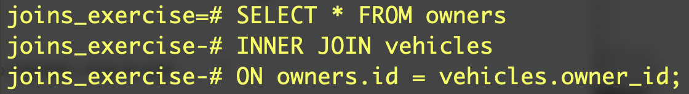
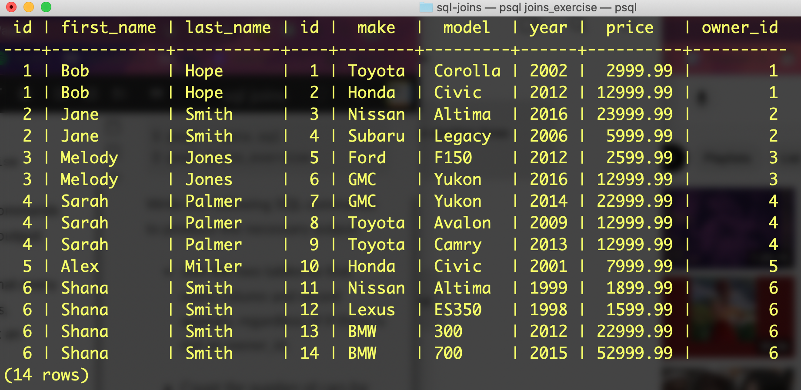
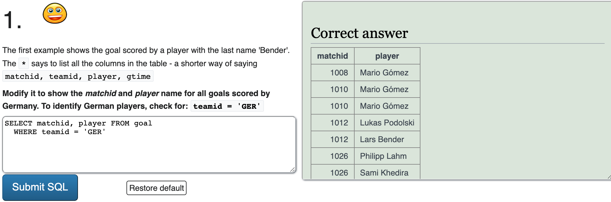
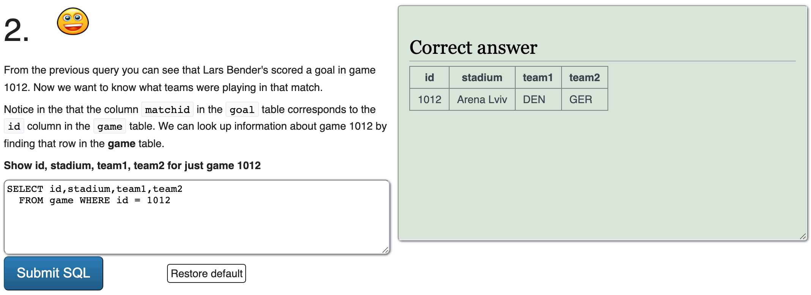
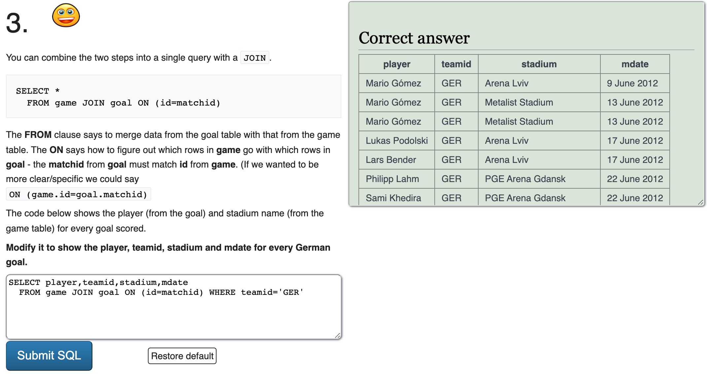
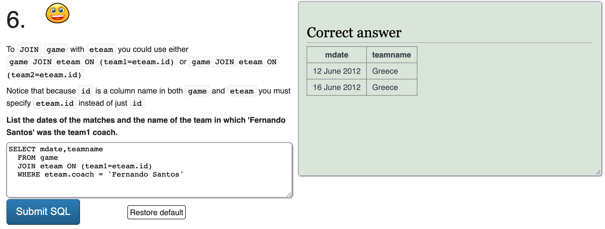

# Joins Exercise

## Part 1 

Download our `starter.sql` file 

    $ psql < data.sql
    $ psql joins_exercise

Write the following SQL commands to produce the necessary output:

-   Join the two tables so that every column and record appears, regardless of if there is not an  owner_id.

- Count the number of cars for each owner. Display the owners  first_name,  last_name  and  count  of vehicles. The first_name should be ordered in ascending order. 
- Count the number of cars for each owner and display the average price for each of the cars as integers. Display the owners  first_name,  last_name, average price and count of vehicles. The  first_name  should be ordered in descending order. Only display results with more than one vehicle and an average price greater than 10000. 

## Part 2

Complete the exercises in the Tutorials steps 6 and 7 in  [https://sqlzoo.net/](https://sqlzoo.net/)

### Tutorial 6 - Join

