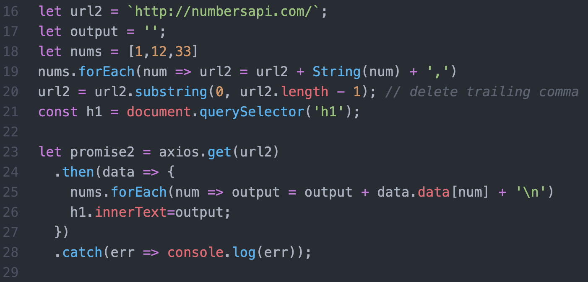

# Springboard - Kaitlin

## Part 1: Number Facts

1.  Make a request to the Numbers API ([http://numbersapi.com/](http://numbersapi.com/)) to get a fact about your favorite number. (Make sure you get back JSON by including the  json  query key, specific to this API.  

    
2.  Figure out how to get data on multiple numbers in a single request. Make that request and when you get the data back, put all of the number facts on the page.

    
3.  Use the API to get 4 facts on your favorite number. Once you have them all, put them on the page. It’s okay if some of the facts are repeats.

## Part 2: Deck of Cards

1.  Make a request to the  [Deck of Cards API](http://deckofcardsapi.com/)  to request a single card from a newly shuffled deck. Once you have the card,  console.log  the value and the suit (e.g. “5 of spades”, “queen of diamonds”).
    

2.  Make a request to the deck of cards API to request a single card from a newly shuffled deck. Once you have the card, make a request to the same API to get one more card from the  **same**  deck.
    
    Once you have both cards,  console.log  the values and suits of both cards.
    

    
3.  Build an HTML page that lets you draw cards from a deck. When the page loads, go to the Deck of Cards API to create a new deck, and show a button on the page that will let you draw a card. Every time you click the button, display a new card, until there are no cards left in the deck.

