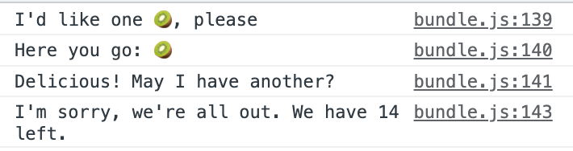

# ES2015 Module Exercise
## ReactJS - Create React App

This exercise gives you practice with ES2015-style import/export.

So that we can work with import/export, we’ll use create-react-app to get a starter skeleton. However, we won’t be building an actual React app.

So: start by deleting everything inside of the src/ directory, and then doing your work inside of this now-empty directory.

### Let's Do This

`npx create-react-app mod-exercise`
`cd mod-exercise`

### Requirements

For this assignment you should create three JavaScript files:

**src/helpers.js**

This file should export two array helper functions:

-   **choice(items)**: returns a randomly selected item from array of items
-   **remove(items, item)**: removes the first matching item from items, if item exists, and returns it. Otherwise returns undefined.

---

**src/foods.js**
This file should export this array of fruits:

    [
      "🍇", "🍈", "🍉", "🍊", "🍋", "🍌", "🍍", "🍎",
      "🍏", "🍐", "🍒", "🍓", "🥝", "🍅", "🥑",
    ];

---

**src/index.js**
This file should import the fruits and both array helpers. It should then:

Randomly draw a fruit from the array
Log the message “I’d like one RANDOMFRUIT, please.”
Log the message “Here you go: RANDOMFRUIT”
Log the message “Delicious! May I have another?”
Remove the fruit from the array of fruits
Log the message “I’m sorry, we’re all out. We have FRUITSLEFT left.”

### Requirements
Submissions
**src/helpers.js**

    // returns a randomly selected item from an array of items
    const choice = (items) => {
      const random = items[Math.floor(Math.random() * items.length)];
      return random;
    };
    
    // removes the first matching item from items if it exists & returns it
    // if it doesn't exist, return undefined
    const remove = (items, item) => {
      const idx = items.indexOf(item);
      if(idx == -1) {
        return undefined;
      }
      items.splice(idx, 1);
    };
    
    export { choice };
    export { remove };

**src/foods.js**

    const arr = [
          "🍇", "🍈", "🍉", "🍊", "🍋", "🍌", "🍍", "🍎",
          "🍏", "🍐", "🍒", "🍓", "🥝", "🍅", "🥑",
    ];
    
    export default arr;

**src/index.js**

    import arr from "./foods";
    import { choice, remove } from "./helpers";
    
    const randomFruit = choice(arr);
    console.log(`I'd like one ${randomFruit}, please`);
    console.log(`Here you go: ${randomFruit}`);
    console.log('Delicious! May I have another?');
    remove(randomFruit);
    console.log(`I'm sorry, we're all out. We have ${arr.length-1} left.`);

**Output**

Run with `npm start`
